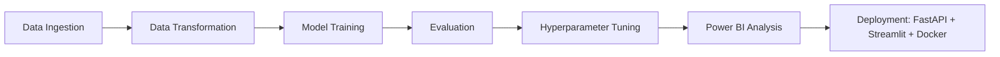
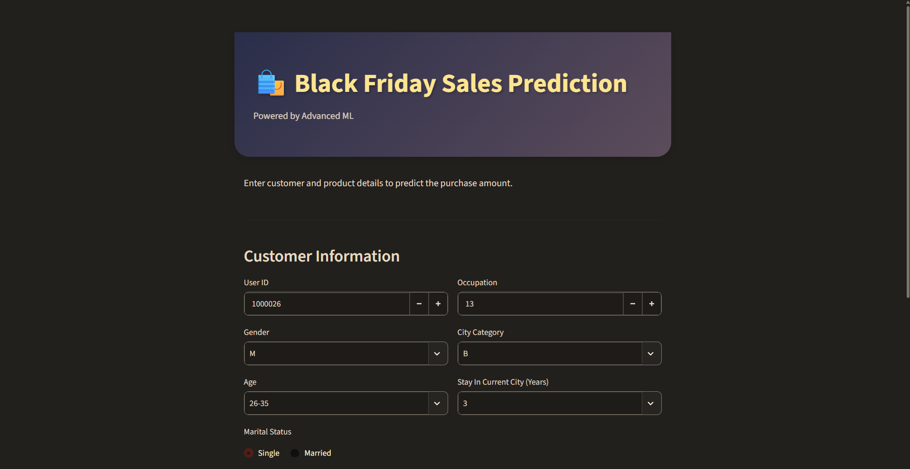
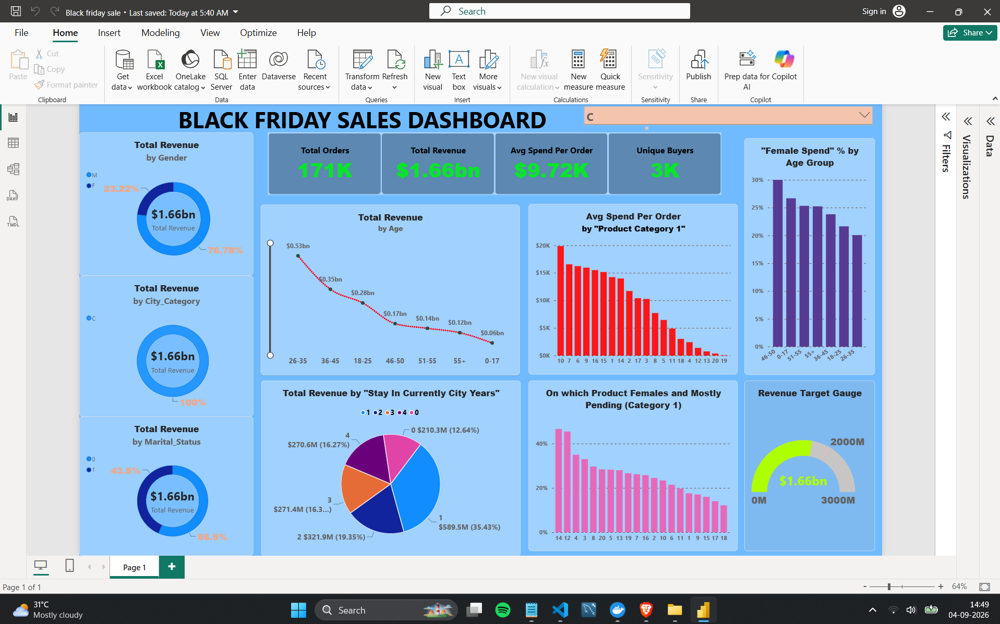

# 🛍️ Black Friday Sales Analysis & ML Project

<div align="center">

**An end-to-end Machine Learning system that predicts customer purchase amounts on Black Friday — from raw data to a live, containerized, deployed application.**

[](https://www.python.org/)
[](https://xgboost.readthedocs.io/)
[](https://fastapi.tiangolo.com/)
[](https://streamlit.io/)
[](https://www.docker.com/)
[](https://render.com/)
[](https://powerbi.microsoft.com/)

### 🚀 [**Live Demo → black-friday-ui.onrender.com**](https://black-friday-ui.onrender.com)

</div>

---

## 📌 Overview

This project predicts how much a customer will spend during a **Black Friday sale**, built on a real-world retail dataset of **550,000+ transactions** (with a separate 233,000-row holdout test set). It goes beyond a notebook experiment — the full lifecycle is covered: **data ingestion → cleaning → EDA → feature engineering → modular training pipelines → hyperparameter tuning → business dashboards → containerized deployment.**

The final model — a tuned **XGBoost Regressor** — was wrapped behind a **FastAPI** backend and a **Streamlit** UI, containerized with **Docker**, and deployed live on **Render**. Business-facing insights were additionally delivered through a **Power BI** dashboard.

---

## ✨ Highlights

| | |
|---|---|
| 📊 **Dataset Scale** | 550K+ training rows, 233K test rows |
| 🏆 **Best Model** | XGBoost Regressor (hyperparameter-tuned) |
| ⚙️ **Architecture** | Modular ML pipeline (ingestion → transformation → training → tuning) |
| 🌐 **Serving** | FastAPI (inference API) + Streamlit (interactive UI) |
| 📦 **Deployment** | Dockerized, live on Render |
| 📈 **Business Layer** | Power BI dashboard for stakeholder-facing insights |

---

## 🧠 Problem Statement

A retail company wants to understand and predict **customer purchase behavior** during Black Friday sales based on demographic and product-related attributes — enabling smarter inventory planning, targeted promotions, and revenue forecasting.

**Target variable:** `Purchase` (amount spent)

---

## 🗂️ Project Architecture

```
Black-Friday-Sales-Prediction/
│
├── src/
│   └── my_project/
│       ├── components/
│       │   ├── data_ingestion.py
│       │   ├── data_transformation.py
│       │   ├── model_trainer.py
│       │   └── model_monitoring.py
│       ├── pipelines/
│       │   ├── training_pipeline.py
│       │   └── prediction_pipeline.py
│       ├── exceptions.py
│       ├── logger.py
│       └── utils.py
│
├── fastapi_app/              # Inference REST API
├── streamlit_app/            # Interactive frontend
├── PowerBI/                  # Business intelligence dashboard
├── notebook/                 # EDA & experimentation
├── artifacts/                # Saved models, preprocessors, datasets
├── catboost_info/            # CatBoost training logs
├── Screenshots/              # App & dashboard previews
├── logs/                     # Pipeline run logs
├── .dvc / .dvcignore         # Data version control
├── docker-compose.yml
├── Dockerfile.fastapi
├── Dockerfile.streamlit
├── requirements.txt
├── setup.py
├── template.py
└── README.md
```

---

## 🔄 End-to-End Pipeline Flow



1. **Data Ingestion** — Reads raw data and stores it as structured train/test artifacts.
2. **Data Transformation** — Missing-value handling, feature engineering (frequency encodings, missing-indicator flags, combination categorical features), and preprocessing via a `ColumnTransformer` (imputation + scaling + one-hot encoding).
3. **Model Training** — Multiple regressors trained and benchmarked.
4. **Evaluation** — Compared on R², MAE, and RMSE.
5. **Hyperparameter Tuning** — Best model tuned via `RandomizedSearchCV` (GPU-accelerated).
6. **Power BI** — Business-facing dashboard built on the cleaned dataset.
7. **Deployment** — Serving via FastAPI + Streamlit, containerized with Docker, deployed on Render.

---

## 🧹 Data Cleaning & Feature Engineering

- Handled missing values in product category fields with dedicated **missing-indicator flags**
- Engineered **`Product_Frequency`** and **`User_Frequency`** encodings from value counts
- Created combination categorical features: `Age_Gender`, `Age_City`, `Occupation_City`, `Occupation_Age`
- Numerical features: median imputation + standard scaling
- Categorical features: most-frequent imputation + one-hot encoding (unseen categories handled gracefully)
- Combined via a unified `ColumnTransformer` pipeline for consistent train/test processing

---

## 📊 Exploratory Data Analysis (EDA)

In-depth EDA was performed to uncover purchasing patterns across:

- Age groups & gender-based spending behavior
- City category & years of stay influence on purchase amount
- Product category popularity and purchase value distribution
- Occupation-wise and marital-status-wise spending trends

*(See `notebook/` and `Screenshots/` for detailed visualizations.)*

---

## 🤖 Model Training & Results

Multiple regression models were trained and benchmarked on the same preprocessed data:

| Model | R² Score |
|---|---|
| Decision Tree | 0.6512 |
| Linear Regression | 0.6704 |
| Ridge Regression | 0.6704 |
| Gradient Boosting (Hist) | 0.6877 |
| CatBoost | 0.6993 |
| Random Forest | 0.7022 |
| **XGBoost** 🏆 | **0.7282** |

### 🎯 XGBoost — Hyperparameter Tuned (Winner)

Tuned using `RandomizedSearchCV` (40 iterations, 3-fold CV, GPU-accelerated):

| Metric | Before Tuning | After Tuning |
|---|---|---|
| R² Score | 0.7282 | **0.7443** |
| MAE | 1941.86 | **1873.30** |
| RMSE | 2613.52 | **2534.68** |

**Best Parameters:** `n_estimators=400`, `max_depth=10`, `learning_rate=0.15`, `subsample=0.9`, `colsample_bytree=0.7`, `min_child_weight=7`, `gamma=0.2`

---

## 🏗️ Tech Stack

| Category | Tools |
|---|---|
| **Language** | Python |
| **Data Handling** | Pandas, NumPy |
| **Visualization** | Matplotlib, Seaborn, Power BI |
| **Modeling** | Scikit-learn, XGBoost, CatBoost |
| **Tuning** | RandomizedSearchCV (GPU-accelerated) |
| **Data Versioning** | DVC |
| **Backend API** | FastAPI |
| **Frontend** | Streamlit |
| **Containerization** | Docker, Docker Compose |
| **Deployment** | Render |

---

## 🌐 Live Application

🔗 **Try it here:** [black-friday-ui.onrender.com](https://black-friday-ui.onrender.com)

The deployed app lets users input customer & product attributes and get a real-time predicted purchase amount, powered by the tuned XGBoost model served through FastAPI.

>  Hosted on Render's free tier — the app may take a few seconds to spin up on first load.

---

## 🐳 Running Locally with Docker

```bash
git clone <https://github.com/dhruuvvsharma/Black-Friday-Sales-Prediction>
cd Black-Friday-Sales-Prediction

# Build and run both services (FastAPI + Streamlit)
docker-compose up --build
```

- FastAPI backend → `http://localhost:8000`
- Streamlit frontend → `http://localhost:8501`

---

## ⚙️ Local Setup (Without Docker)

```bash
# Create virtual environment
python -m venv venv
venv\Scripts\activate   # Windows
source venv/bin/activate  # macOS/Linux

# Install dependencies
pip install -r requirements.txt

# Run training pipeline
python src/my_project/pipelines/training_pipeline.py

# Run FastAPI app
uvicorn fastapi_app.main:app --reload

# Run Streamlit app
streamlit run streamlit_app/app.py
```

---

## 📈 Power BI Dashboard

A dedicated **Power BI** dashboard was built on top of the cleaned dataset to surface business-relevant insights — spending trends by demographics, city category, and product category — for non-technical stakeholders. *([visit](<PowerBI/Black friday sale.pbix>))*

---

## 📸 Screenshots 
Screenshots of the UI of the Streamlit app and the Power BI dashboard are provided in Screenshots folder...





---

## 🔮 Future Improvements

- Add CI/CD pipeline for automated retraining and deployment
- Integrate MLflow for experiment tracking
- Add model monitoring/drift detection in production
- Migrate to a scalable cloud deployment (AWS/GCP) for lower cold-start latency

---

## 👤 Author

**Dhruv** — B.Tech CSE (Data Science)

If you found this project useful, consider giving it a ⭐ on GitHub!